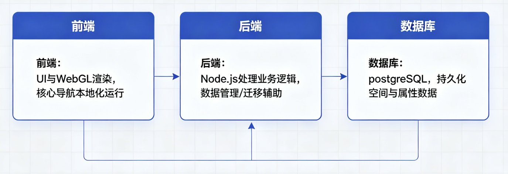
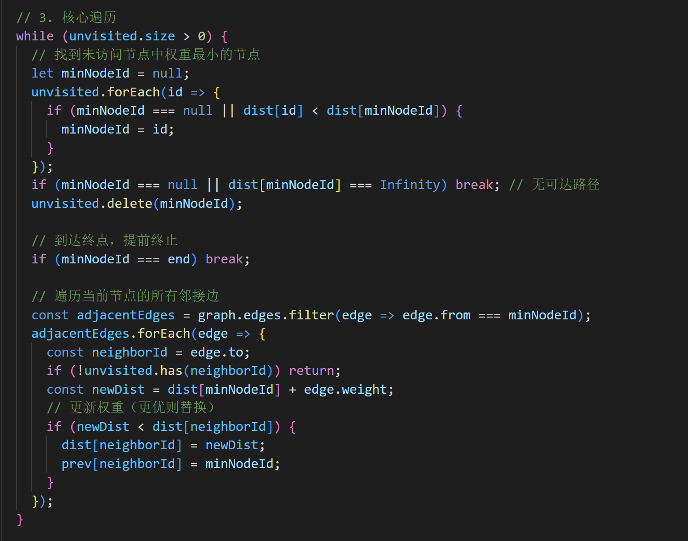

# 软件说明书（中期 / 结项共用主文档）
> 使用说明 
>
> + 本文档作为**中期检查**与**最终软件说明书**的共用主文档。  
> + **中期阶段**：先完成标注为“中期必填”的内容；标注为“结项补全”的内容可暂留空。  
> + **结项阶段**：在中期版本基础上继续补全，整理后导出为最终doc/docx。  
> + 过程性图片请单独存放在`assets/`目录，正文中使用相对路径引用。  
> + 过程考核以Git中的md增量记录为主，最终排版稿以导出的doc/docx为准。
>

---

## 基本信息
**项目名称：校园导航及地点信息处理系统**  
**学    院：** 计算机学院  
**小组序号：** 31  
**成员姓名：** 屈湘华，祃昱辰，李旭，何旭诚  
**指导老师：** 尹兆远  
**当前版本：** 中期版   
**更新日期：** 2026年5月5日  

---

## 一、项目概述  【中期必填】
### 1. 项目背景
目前校园导航多依赖平面静态地图，缺乏直观的立体空间感，在新生报到，校外参观，校园浏览时存在路线不熟、最优路径查找困难的问题。  为了让同学们更好的找到对应的地点坐标，参观校园，本项目旨在基于现有的前端导航逻辑，通过引入后端与空间数据库，将湘大校园导航升级为具备3D建筑展示、动态路径规划和地点信息维护功能的综合系统 ，解决校园导航痛点  。

### 2. 系统目标
+ 实现基于 PostGIS 的 3D 建筑数据存储与高度渲染。
+ 构建支持动态拥挤度调整的 Dijkstra 最短路径算法。
+ 开发管理员后台，支持地点图片上传与地理坐标维护。
+ 支持多个个性化功能，如对应地点失物招领，对应建筑同学点评。
+ 地图视角控制，点击某个地点后，视角可平滑移动聚焦于此。
+ 管理员可登录后台修改地点描述、坐标及路网信息。
+ 支持对应地点信息查询。
+ 筛选功能，让用户选择想看内容。
+ 详情面板实现，当点击3D建筑后，展示数据库里的描述，图像等信息。
+ 完成相应式适配，支持电脑，手机，平板等不同设备的互通使用。

### 3. 开发环境与条件
+ 开发工具 vscode,github
+ 数据库 postgreSQL + postGIS
+ 运行环境 Node.js
+ 兼容要求 主流浏览器，移动端

---

## 二、需求分析  【中期必填】
### 1. 功能需求
+ 登录模块，支持用法注册，管理员注册。
+ 建筑根据数据库height字段进行3D拔高显示。
+ 加载湘大地图，标注所有景点位置。
+ 支持点对点最短路径查询，并结合拥挤程度计算最优权重。
+ 支持点击建筑查看对应的信息。
+ 管理员可登录后台修改地点描述、坐标及路网信息。
+ 支持不同时段选择，适配人流规划。
+ 响应式适配，在不同设备上均可使用。
+ 失物查找功能，查询对应地点的失物。
+ 路线的绘制，显示详细信息。

### 2. 非功能需求
+ 性能要求  路线计算响应时间＜1 秒，地图加载流畅 。
+ 安全要求  非管理员不得进入后台更改信息。
+ 兼容性要求 适配主流的浏览器，移动设备。

---

## 三、系统设计  【中期必填】
### 1. 系统架构
采用前后端分离架构，前端负责UI与WebGL渲染，核心导航能力在前端本地化运行 。后端通过Node.js处理业务逻辑 ，承担数据管理 / 迁移辅助职责 。数据库使用postgreSQL负责持久化空间与属性数据。


### 2. 模块设计
+  前端交互模块 index.html  系统前端唯一入口，承载所有 UI 组件  ，整合所有前端资源。 css/style.css  统一控制页面样式  。

导航算法模块   js/dijkstra.js   实现经典 Dijkstra 最短路径算法，接收格式化后的校园节点数据。

 数据处理模块  js/data.js  存储校园导航核心图数据，是导航计算的数据源；json/xtu_graph.json  读取并解析xtu_graph.json的原始数据，格式化后适 配dijkstra.js的算法输入要求，同时将算法输出的路径数据转换为前端可渲染的格式。  

地图交互模块   js/map.js 加载assets/xtu-map.jpg底图并渲染到页面  

用户在index.html操作，选择起点 / 终点并点击导航，map.js监听事件，调用data.js读取xtu_graph.json， data.js解析数据后传给dijkstra.js，触发最短路径计算；算法计算完成后，data.js将路径数据格式化回传给map.js； map.js在xtu-map.jpg底图上绘制路径，最终在index.html展示结果。

### 3. 数据库设计
+ er图
+ 主要数据表设计
+ NODE_TYPE：给节点分类，记录分类名称 ，方便批量管理。
+  NODE：存储校园导航点位，核心字段是名称、高精度坐标，关联类型表保证信息完整。
+ EDGE：记录节点间的连接关系，核心是起点 / 终点、路径权重，支撑最短路径算法，关联节点表避免无效数据。

> 中期要求：架构、模块、数据库设计基本定稿。  
结项要求：与最终系统一致，如有调整需同步更新。  
>

---

## 四、系统实现  【中期部分填写；结项补全】
### 1. 关键技术
核心是Dijkstra最短路径算法，基于 EDGE 表中存储的路径权重，计算任意两个导航节点间的最优路径，是校园导航路径规划的核心逻辑。

（说明使用的核心算法、框架或技术难点解决方案）

### 2. 界面展示


（提供主要功能界面截图并配文字说明）

### 3. 核心代码片段
核心是Dijkstra最短路径算法



（展示关键功能的代码并注释，例如数据库连接、核心算法）


> 中期要求：  
>
> + 可先填写已确定的关键技术；  
> + 可展示已完成页面或原型图；  
> + 核心代码片段可暂不完整。
>
> 结项要求：  
>
> + 补全最终关键技术说明；  
> + 使用真实系统界面截图替换原型图；  
> + 展示关键功能的代码片段。
>

---

## 五、系统测试  【中期先写方案；结项补全结果】
+ 功能测试：手动编写脚本执行节点边分类的 CRUD 操作，调用路径规划接口，校验返回结果是否符合预期。
+ 对数据，算法和功能进行测试验证。


（简述测试方法和测试范围）

### 2. 测试结果
（展示主要测试用例及结果）

### 3. 问题与改进
（说明发现的问题及改进措施）

> 中期要求：  
>
> + 先写测试计划、测试范围、测试思路；  
> + 可列出准备执行的测试用例。
>
> 结项要求：  
>
> + 补全真实测试结果；  
> + 记录主要问题及修正情况。
>

---

## 六、用户手册  【结项补全】
### 1. 安装部署说明
（说明环境配置与部署步骤）

### 2. 操作指南
（说明系统主要功能的使用方法）

> 中期阶段可暂不写完整。  
结项阶段需根据最终系统补全。  
>

---

## 七、项目总结  【中期可先写阶段总结；结项补全】
### 1. 成果总结
湘潭大学导航系统已搭建基础架构，含前端交互、Dijkstra 最短路径算法、NODE/EDGE/NODE_TYPE 核心数据表及数据同步脚本，支持在线访问，核心实现校园节点导航与路径规划，待验证数据一致性、算法效率等关键环节。

### 2. 不足与改进方向
（说明现存问题与后续优化方向）

### 3. 成员分工表
（说明各成员姓名、班级、学号、git账号、承担的任务，并与Git记录对应）

### 4. Git 提交记录
（附主要提交记录截图或说明）

> 中期要求：  
>
> + 可先写阶段成果、当前问题、下一步计划；  
> + 成员分工与Git阶段记录应已对应。
>
> 结项要求：  
>
> + 更新为最终完成情况；  
> + 补全最终成员分工与Git记录说明。
>

---

## 附录  【中期可留空；结项补全】
+ 参考资料
+ 源代码仓库链接
+ 其他补充材料

---

## 附：推荐的图片与文件组织方式
```latex
docs/
  report/
    中期与结项报告.md
    assets/
      fig_architecture.png
      fig_er.png
      fig_ui_login.png
      fig_ui_admin.png
      fig_test_result.png
```

图片在正文中建议这样引用：

```markdown

```

---

## 附：版本推进建议
+ **中期版**：至少完成 第一～三章，并对第四、五、七章写出当前进展。  
+ **结项版**：在中期版基础上补全第四～七章，整理后导出为最终软件说明书。  
+ **不要中期另写一套、结项再重写一套。**

