**编制日期**：2026-05-11**项目名称**：湘潭大学校园景点导航系统

## 文档说明
本文档为《湘潭大学校园景点导航系统测试用例文档》的配套测试结果汇总，覆盖前端、后端、算法、兼容性、异常场景全模块测试用例的执行结果。

## 测试结果总表
表格

| **用例 ID** | **测试模块** | **测试结果** | **截图说明** |
| :--- | :--- | :--- | :--- |
| TC001 | 前端首页页面加载 | 通过  |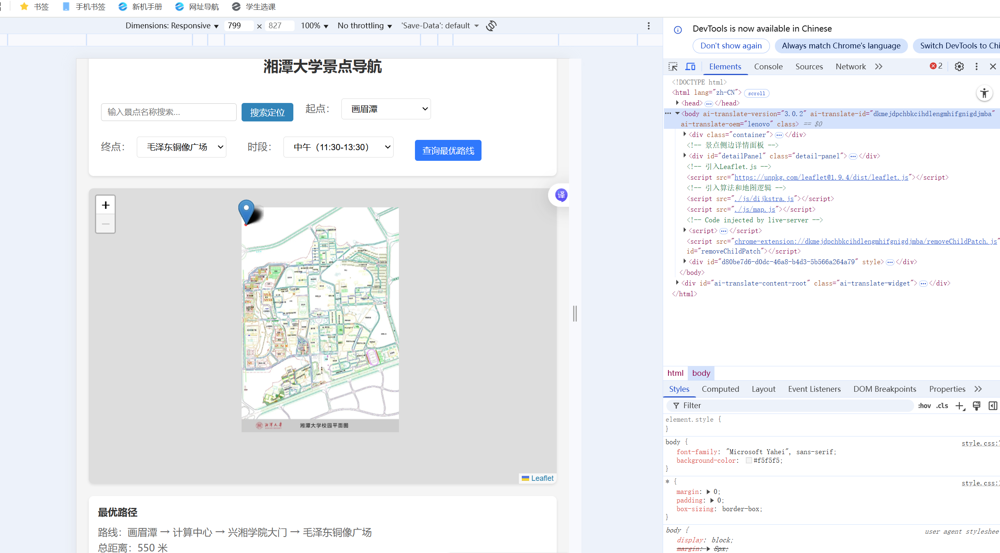  |
| TC002 | 前端静态资源完整性 | 通过  | 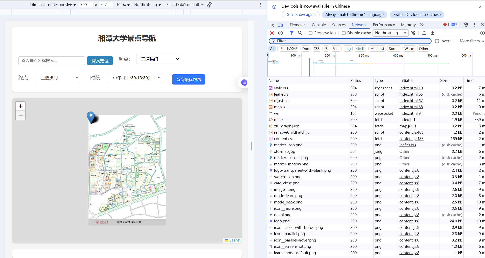| TC003 | 地图基础交互 - 缩放 | 通过  | 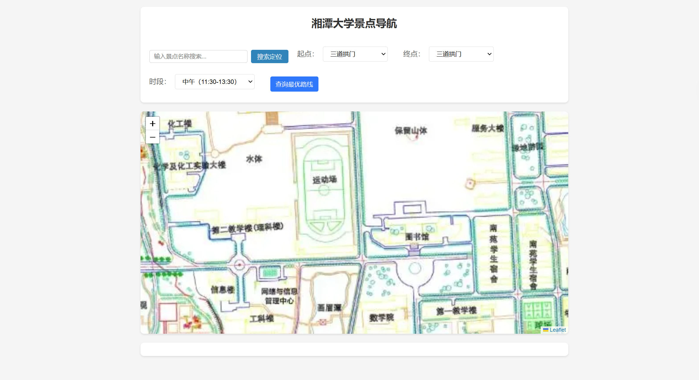 |
| TC004 | 地图基础交互 - 拖拽 | 通过  | 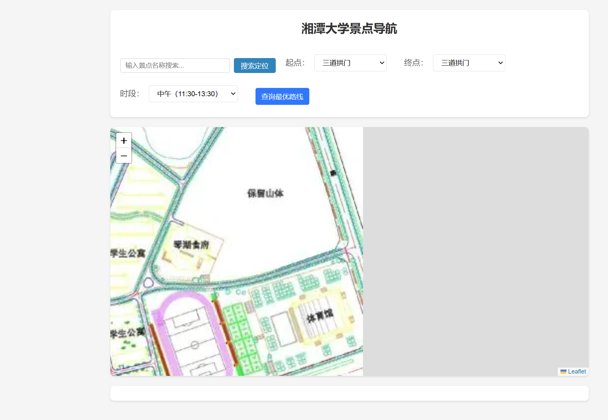 |
| TC005 | 正常路径规划 | 通过 |  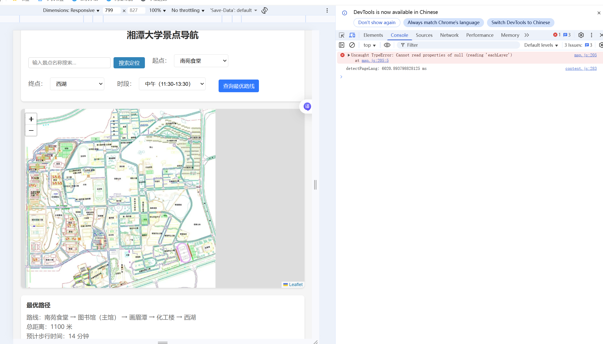 |
| TC006 | 路径规划 - 起点终点相同异常 | 通过 | 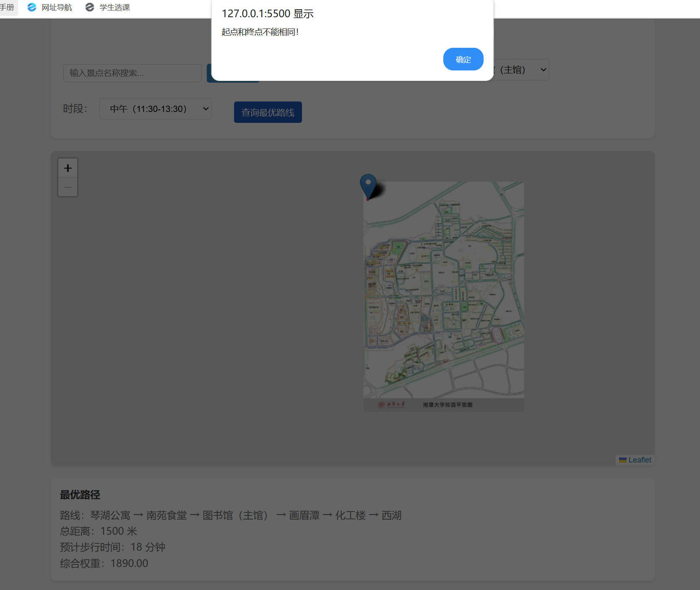 |
| TC007 | 3D 导航页面访问 | 通过 | 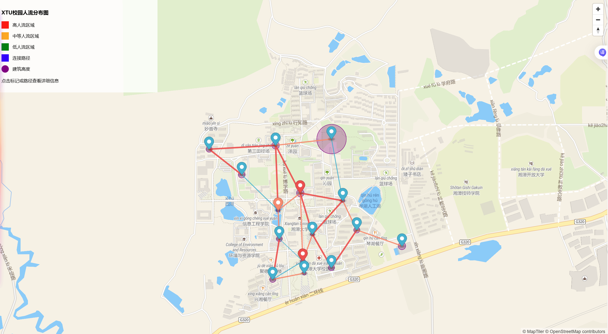 |
| TC008 | 3D 地图视角交互 | 通过  | 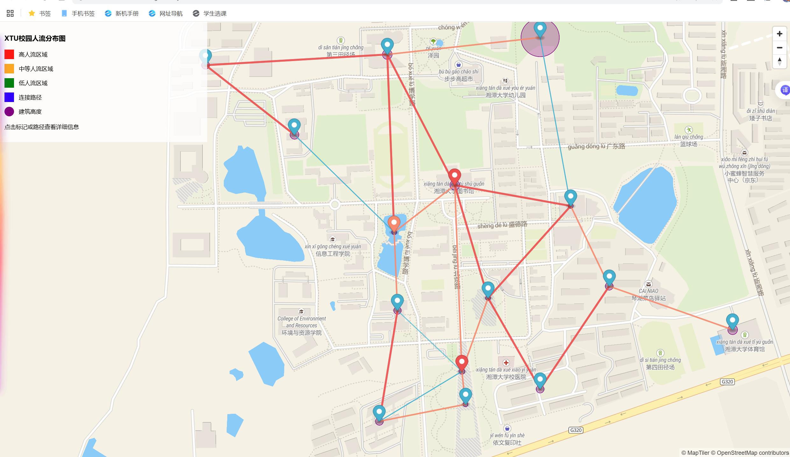 |
| TC009 | 后端依赖安装 | 通过 | 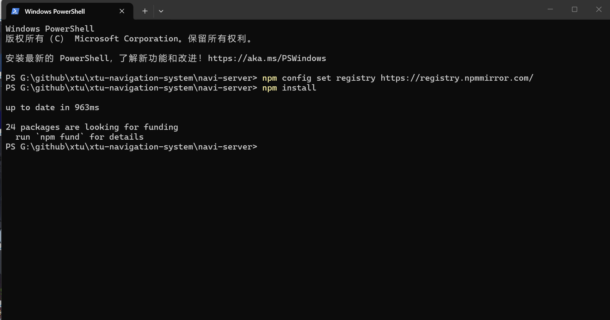 |
| TC010 | 后端服务启动 | 通过 | 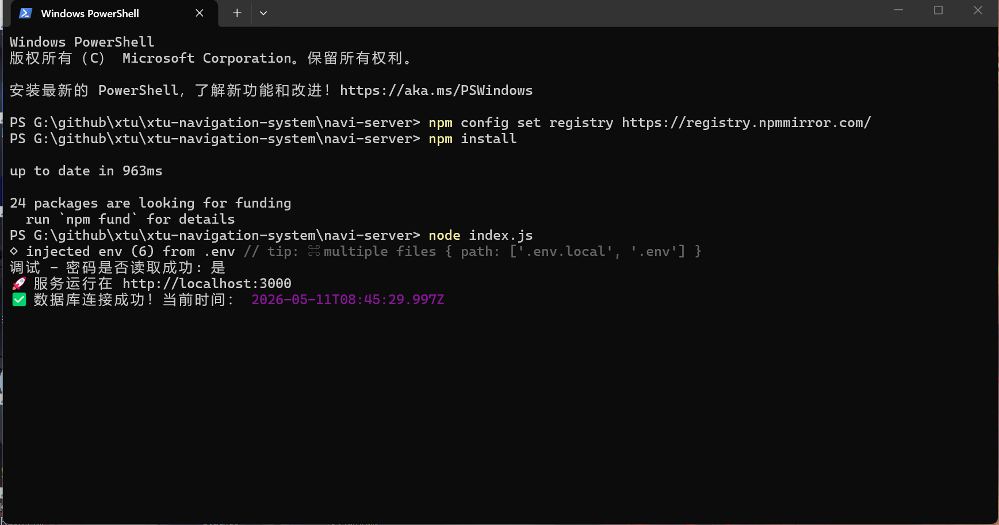 |
| TC011 | 数据库初始化导入 | 通过  | 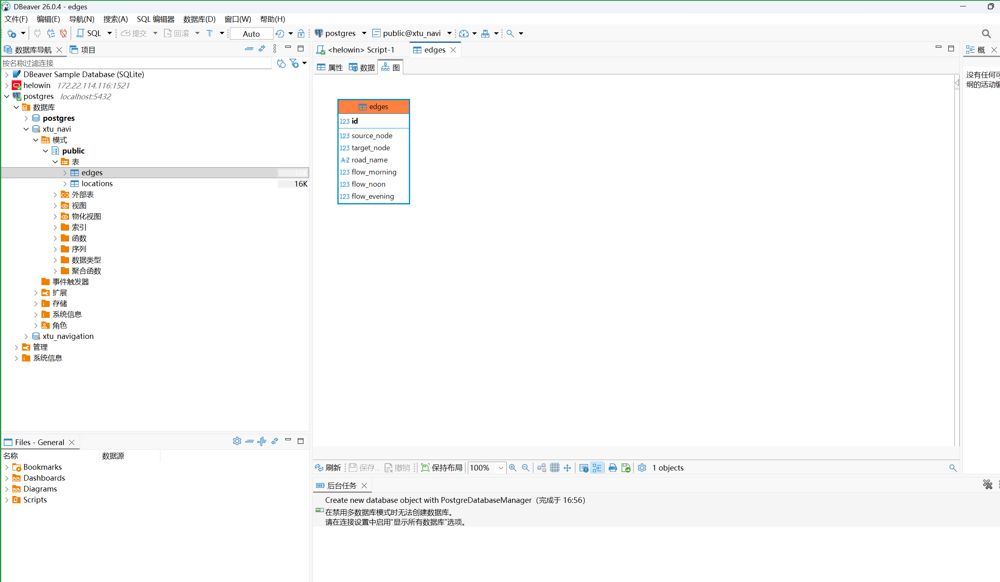 |
| TC012 | 后端接口访问测试 |  失败  | 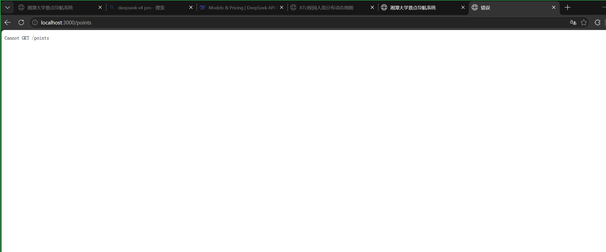 |
| TC013 | 前后端联调 - 路径规划 |  失败  | 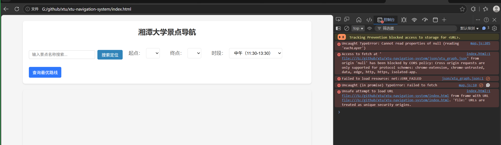 |
| TC014 | 浏览器兼容性 - Edge | 通过  | 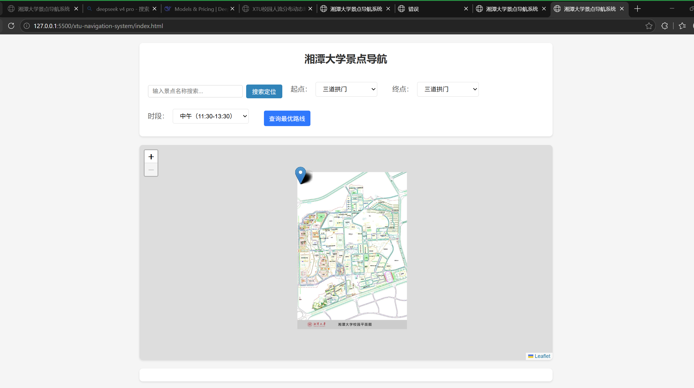 |
| TC015 | 异常场景 - 后端服务中断 | 阻塞 | 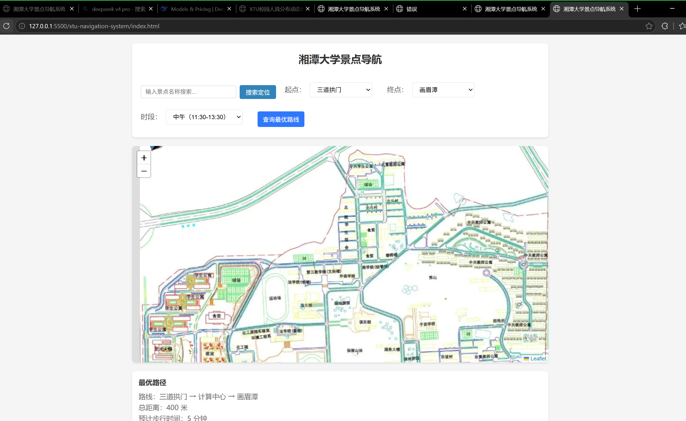 |

## 补充说明
1. 测试结果 “通过” 需满足用例中所有预期结果；“失败” 为部分 / 全部预期结果未达成；“阻塞” 为因环境 / 前置条件问题无法执行测试。

